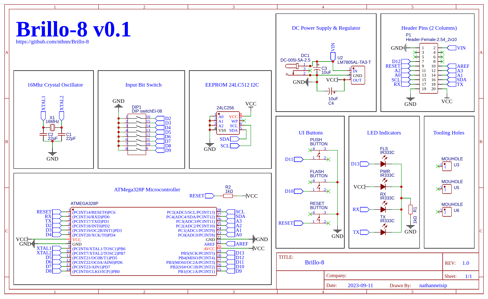

# Brillo-8 Pocket Programmable Computer

   

Brillo-8 is a tiny computer created to carry out instructions saved in a 24LC512 EEPROM (Electrically Erasable Programmable Read-Only Memory). It's packed neatly on a small 80cm x 50mm circuit board. This little computing marvel comes with handy controls like DIP switches, a "PUSH" button for entering instructions, a "FLASH" button for running instructions from the EEPROM, and a "RESET" button to start over if needed.

Brillo-8, a fascinating fusion of hardware and software innovation, invites both enthusiasts and developers to embark on a captivating adventure into the miniature computing. This small but powerful virtual machine, residing within the trusted ATMega328P microcontroller, offers a compelling platform for several compelling reasons.

This repository contains all the necessary resources, including hardware schematics, Arduino firmware, license, and documentation, to get you started with building and using Brillo-8.

## Features

- **Brillo-8 Virtual Machine**: Brillo-8 hosts a virtual machine right inside the ATMega328P microcontroller. This virtual machine is like the brain of Brillo-8, designed to carry out custom programmed instructions on the 24LC512 EEPROM.

- **24LC512 EEPROM Storage**: To make sure the instructions you program into Brillo-8 stick around, it relies on a 24LC512 EEPROM chip. This chip is like its memory bank, ensuring that your programmed instructions remain safe and sound even when the power goes off or the system restarts.

- **User-Friendly Input**: Using Brillo-8 is a breeze, thanks to its user-friendly interface. You can input instructions effortlessly with eight DIP switches, each representing a bit of instruction the user is inputting. These switches, combined with a handy "PUSH" button, make configuring instructions a straightforward process.

- **Execution Control**: Want to set your instructions in motion? Just hit the "FLASH" button. It's like starting the engine of Brillo-8, making it carry out the instructions you've stored in its memory. And when you need a fresh start or want to reset everything, the "RESET" button is there to help.

- **ATMega328P Microcontroller**: At the core of Brillo-8 lies the ATMega328P microcontroller. This microcontroller runs the show, and its firmware acts as the blueprint for how Brillo-8 behaves. You can think of this firmware as the rulebook that lets you customize Brillo-8's operations to suit a wide range of tasks and fun projects.

## PCB Preview

| Top View | Bottom View |
|--------------|-----------------|
|  |  |

## Schematic Diagram

## Why Brillo-8?

1. **An Ideal Learning Tool**

    Brillo-8 stands as an excellent educational resource, making it easy for individuals of all skill levels to grasp the inner workings of microcontrollers, EEPROMs (memory chips), and virtual machines. With its user-friendly interface, featuring DIP switches and straightforward buttons, Brillo-8 is accessible even for beginners. It provides an opportunity to explore fundamental programming concepts, memory management, and hardware integration in a compact and hands-on manner.

2. **Unleash Your Creativity**

    What makes Brillo-8 truly captivating is its limitless potential for customization.  Brillo-8 empowers you to bring your creative ideas to life.

3. **Hands-On Electronics Experience**

    For those eager to get hands-on experience with electronics, Brillo-8 offers a practical playground. Assembling the hardware components, including the PCB (circuit board) and various switches, provides a deeper understanding of electronic design and soldering techniques. This tangible aspect of Brillo-8 enriches the learning process and hones valuable skills for electronics enthusiasts.

4. **Swift Prototyping and Experimentation**

    Brillo-8 is an excellent platform for rapid prototyping and experimentation. It serves as a perfect testing ground for developing and testing new algorithms, code snippets, or entire programs. By using Brillo-8, you can quickly try out different ideas, observe their effects, and refine your solutions before implementing them in more extensive projects.

## Contributing

Contributions to the Brillo-8 project are all welcome. If you have ideas for improvements, new features, or bug fixes, please feel free to submit pull requests or open issues on the GitHub repository.

## License

Brillo-8 has two (2) license. The hardware itself (including the PCB Gerber files and the schematic diagram) is under the CERN Open Hardware Licence Version 2 - Strongly Reciprocal, while the Brillo-8 repository as a whole is under MIT Public License.

Both licenses have distinct characteristics and implications.

The CERN Open Hardware License (CERN OHL) is designed to facilitate the sharing and collaboration of open hardware designs. The CERN v2 Strong license places an emphasis on ensuring modifications to the original hardware design remain open and under the same license. It promotes the sharing of derivative works and requires contributors to provide proper attribution.

The MIT License is one of the most permissive open-source licenses. It allows others to use, modify, distribute, and even incorporate your code into proprietary projects. Users of MIT-licensed software typically have fewer restrictions, making it a widely adopted license for software libraries and components.